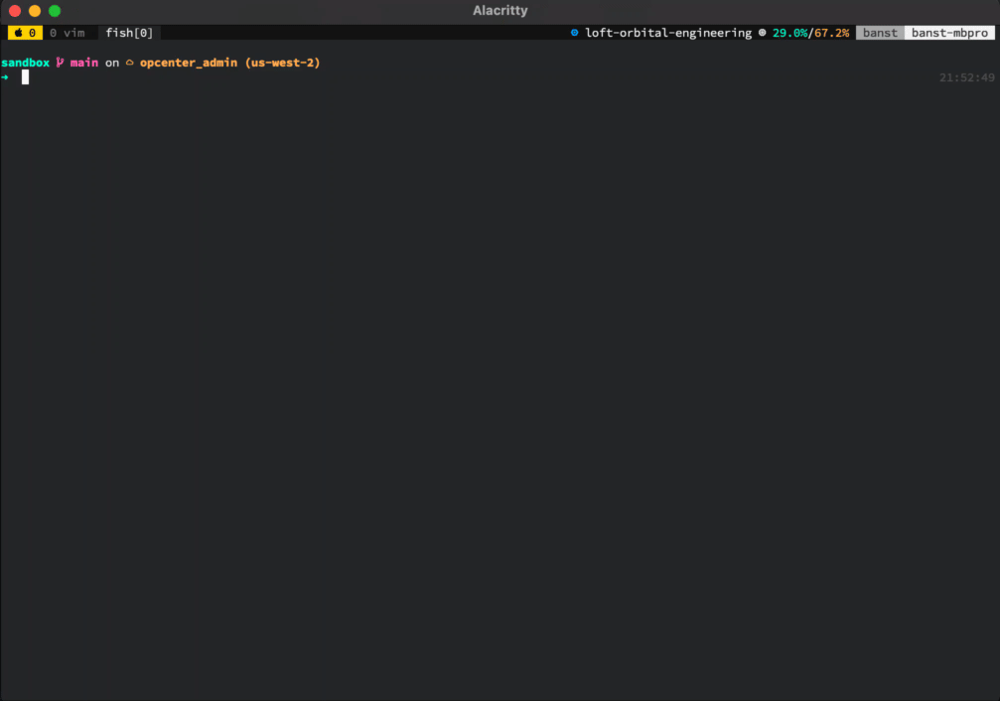

<!-- omit in toc -->
# Turbogit (tug)

[](https://github.com/b4nst/turbogit/actions?query=workflow%3AGo)
[](https://github.com/b4nst/turbogit/releases/latest)
[](https://codeclimate.com/github/b4nst/turbogit/test_coverage)
[](https://codeclimate.com/github/b4nst/turbogit/maintainability)


tug is a cli tool built to help you deal with your day-to-day git work.
tug enforces conventions (e.g. [The Conventional Commits](https://www.conventionalcommits.org/en/v1.0.0/))
without overwhelming you. tug is your friend.



- [Usage](#usage)
- [Installation](#installation)
  - [macOS](#macos)
    - [Macports (preferred)](#macports-preferred)
    - [Homebrew](#homebrew)
  - [Linux](#linux)
    - [Debian/Ubuntu](#debianubuntu)
    - [Fedora](#fedora)
    - [Centos](#centos)
    - [openSUSE/SUSE](#opensusesuse)
  - [Windows](#windows)
  - [Other platforms](#other-platforms)
- [Shell completion](#shell-completion)
  - [Bash](#bash)
  - [Zsh](#zsh)
  - [Fish](#fish)
- [Contributing](#contributing)

## Usage

```shell
Improve your git workflow.

Usage:
  tug [command]

Available Commands:
  branch      Create a new branch
  check       Check the history to follow conventional commit
  commit      Commit staging area
  completion  Generate completion script
  help        Help about any command
  log         Shows the commit logs.
  tag         Create a tag
  version     Print current version

Flags:
      --config string   config file (default is $HOME/.config/tug/tug.toml)
  -h, --help            help for tug

Use "tug [command] --help" for more information about a command.
```

## Installation

[](https://repology.org/project/turbogit/versions)

> turbogit needs [libgit2](https://github.com/libgit2/libgit2) >= 1.1.0 on your system.
> Some package manager will handle its installation automatically

### macOS

`turbogit` is available on [MacPorts](https://www.macports.org/install.php) and Homebrew.

#### Macports (preferred)

install

```shell
sudo port install turbogit
```

upgrade

```shell
sudo port selfupdate && sudo port upgrade turbogit
```

#### Homebrew

install

```shell
brew tap b4nst/homebrew-tap
brew install turbogit
```

upgrade

```shell
brew upgrade turbogit
```

### Linux

#### Debian/Ubuntu

Install and upgrade:

Download the .deb file from the [releases page](https://github.com/b4nst/turbogit/releases/latest)

```shell
sudo apt install ./turbogit_*_linux_amd64.deb
```

#### Fedora

Install and upgrade:

Download the .rpm file from the [releases page](https://github.com/b4nst/turbogit/releases/latest)

```shell
sudo dnf install ./turbogit_*_linux_amd64.rpm
```

#### Centos

Install and upgrade:

Download the .rpm file from the [releases page](https://github.com/b4nst/turbogit/releases/latest)

```shell
sudo yum localinstall ./turbogit_*_linux_amd64.rpm
```

#### openSUSE/SUSE

Install and upgrade:

Download the .rpm file from the [releases page](https://github.com/b4nst/turbogit/releases/latest)

```shell
sudo zypper in ./turbogit_*_linux_amd64.rpm
```

#### Alpine

Install and upgrade:

Download the .apk file from the [releases page](https://github.com/b4nst/turbogit/releases/latest)

```shell
apk add --allow-untrusted ./turbogit_*_linux_amd64.apk
```

### Windows

> Since git2go refactor, tug is not available as a Windows package anymore.
> Please check [#48](https://github.com/b4nst/turbogit/issues/48).

`turbogit` is available via [scoop](https://scoop.sh).

```shell
scoop bucket add scoop-bucket https://github.com/b4nst/scoop-bucket.git
scoop install turbogit
```

### Other platforms

Prebuilt binary available from the [release page](https://github.com/b4nst/turbogit/releases/latest).

## Shell completion

### Fish

```shell
tug completion fish | source
```

To load completions for each session, execute once:

```shell
tug completion fish > ~/.config/fish/completions/tug.fish
```

### Zsh

```zsh
source <(tug completion zsh)
```

To load completions for each session, execute once:

```zsh
tug completion zsh > "${fpath[1]}/_tug"
```

### Bash

```bash
source <(tug completion bash)
```

To load completions for each session, execute once:
*Linux*

```bash
tug completion bash > /etc/bash_completion.d/tug
```

*MacOS*

```bash
tug completion bash > /usr/local/etc/bash_completion.d/tug
```

## Contributing

Thanks for getting involved in turbogit ❤️! Please read the [Contributing guide](CONTRIBUTING.md),
it will help you make your awesome contribution.
