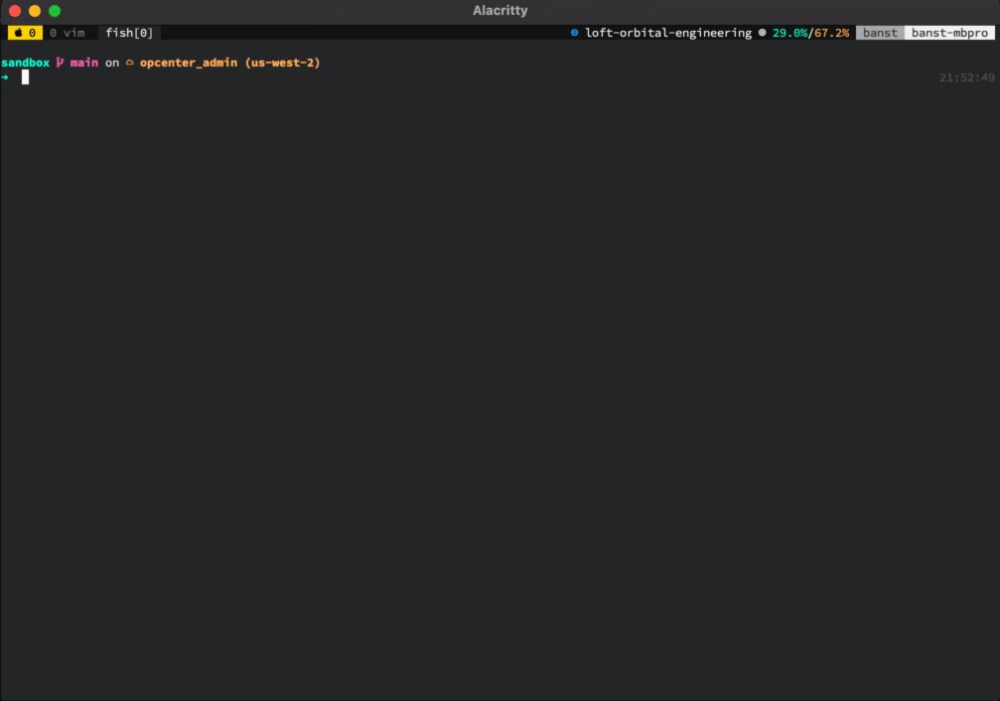

<!-- omit in toc -->
# Turbogit (tug)

Turbogit is a cli tool built to help you deal with your day-to-day git work. Turbogit enforces conventions (e.g. [The Conventional Commits](https://www.conventionalcommits.org/en/v1.0.0/)) but tries to keep things simple and invisible for you. Turbogit is your friend 🛥️.

